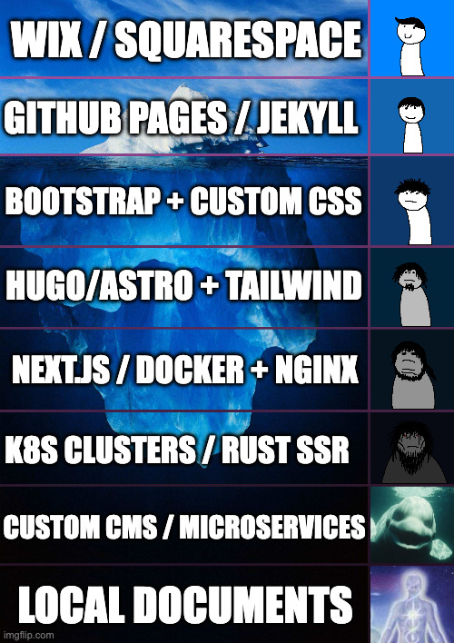

Building a site nowadays is easy, you have sites like Wix or Squarespace that will handle all hosting, domain management, SSL certificates and more for you. The only thing you need to do from your end is choose a silly little domain name for your website and create the content.

## Decision Fatigue



(Prompts generated by AI, made on imgflip)

I like writing documents alot, and I keep a repository of notes locally. However, like every other engineer I've decided I'd like to start writing a blog, the only question was how.

Recently, I've appointed AI as my trusted advisor and have been asking it what would be the best way to learn more about IaC whilst also maintaing a blog. It spat out a few answers which involved a very deep dive into a lot of tools and tech stacks which I was keen into trying out but figured it would be a pain to maintain.

After spending a couple of days I came to the realisation I've been spending so much time on what sort of tech stack I'll be using that I forgot that I don't even have any blog content to post in the first place.

So I decided my first entry will be about my journey in creating this blog.


## Design Standards

I had the following conditions when deciding to build my blogging site:

1. Utilise some sort of Infrastucture as Code (IaC).
    - As I have experience in [CDK](https://aws.amazon.com/cdk/) I've been really interested in expanding my knowledge in IaC. So I'd like to create something that's maintainable but also educational.
2. My blog entries will be written in markdown.
    - I like writing in markdown, it's simple and usable across different systems.

The flow is as follows:

- Blog commits go to GitHub repository (Markdown + Hugo config)

- GitHub Actions triggers Hugo build → generates static site

- Deploys to GitHub Pages

- Users access blog via `https://bib-beep.github.io/BibsBlog/`

> Note: The original plan was to deploy to S3 + CloudFront with a custom domain. GitHub Pages is the current setup to get something live quickly. I'll look into migrating to AWS later — maybe that'll be its own blog entry.

Let's get started.

## Using Hugo

Reading the documentation for Hugo, it looks like I'll need to install this tool. I'm not a big fan of installing stuff onto my systems (unless absolutely necessary) so I figured maybe use a virtual machine to deploy all of this. Then again, it seemed quite overkill to do it this way so I've gone ahead and decided to run it all through Docker.

Technically Docker will download an image if it's not already downloaded on my machine. So when I run Hugo commands, there is a Hugo container being used that was downloaded from an external repository. However, the beauty of using Docker in this case is that it is containerized into a singular image that I can use as a container to run my Hugo commands. After I'm satisfied, I can always delete the image from my system.

> Random Bystander: Oh but surely you can just install it onto your system and then remove it afterwards no?

> Me: Yes, but I prefer the isolation of the package into a singular image rather than it living in my system. Also, I've had trauma in the past with random dependencies and leftover files floating in my system until I notice it again - so Docker it is.

### Using Docker to Create Site

First step is to create my Hugo boilerplate site. Again, this step requires running Hugo, but I can run it on a Hugo container.

I've decided to use the PaperMod theme:
- https://themes.gohugo.io/themes/hugo-papermod/

Following the documentation I'll need to create a new site:

```
hugo new site MyFreshWebsite --format yaml
```

In Docker, this will look as follows:

```
docker run --rm -v "$PWD":/src -w /src ghcr.io/gohugoio/hugo:latest new site Blog --format yaml
```

After running, my boilerplate Hugo site has been created. Now I'll need to install the PaperMod theme. The recommended approach is to use a git submodule:

```
git submodule add --depth=1 https://github.com/adityatelange/hugo-PaperMod.git Blog/themes/PaperMod
```

This keeps the theme version-tracked without vendoring the entire source into the repo.

## Deploying with GitHub Actions

Rather than managing a server or cloud infrastructure upfront, I'm deploying to GitHub Pages. It's free, handles HTTPS automatically, and integrates directly with the repository.

The workflow lives at `.github/workflows/deploy.yml` and triggers on every push to `main`. It:

1. Checks out the repo with submodules (so the PaperMod theme is included)
2. Installs Hugo
3. Builds the site with `hugo --source Blog --minify`
4. Uploads the output and deploys to GitHub Pages

```yaml
name: Deploy to GitHub Pages

on:
  push:
    branches:
      - main

permissions:
  contents: read
  pages: write
  id-token: write

jobs:
  build:
    runs-on: ubuntu-latest
    steps:
      - uses: actions/checkout@v4
        with:
          submodules: recursive
      - uses: peaceiris/actions-hugo@v3
        with:
          hugo-version: latest
      - run: hugo --source Blog --minify
      - uses: actions/upload-pages-artifact@v3
        with:
          path: Blog/public

  deploy:
    environment:
      name: github-pages
      url: ${{ steps.deployment.outputs.page_url }}
    runs-on: ubuntu-latest
    needs: build
    steps:
      - uses: actions/deploy-pages@v4
```

To write a new post, I just create a markdown file under `Blog/content/posts/`, commit it, and push. The site updates automatically within a minute or two.
