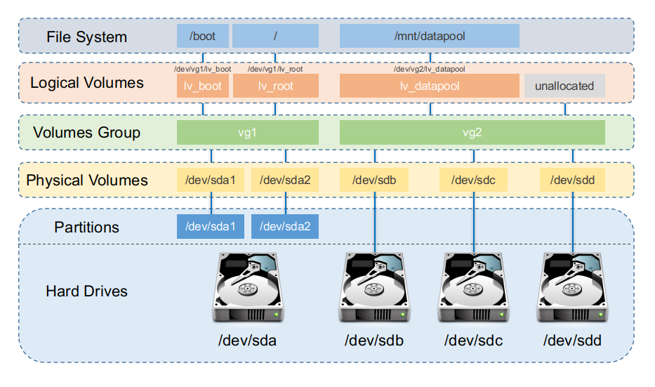

Data is stored on disks that are logically divided into "partitions".

Partitions can exist on a portion of a disk, on an entire disk, or it may even span on multiple disks.

## Logical Volume Manager (LVM)

LVM provides an abstraction layer between the physical storage and the file system - providing the following functionalities for the filesystem:
- Enables resizing.
- Span across multiple disks.
- Use arbitrary disk space.
- etc...



## LVM Components

As shown in the image above, LVM is comprised of the following components explained below.

### Physical Volumes (PVs)

A PV is created when a block storage device such as a partition or an entire disk is initialised and brought under LVM control - for example:

```shell
pvcreate /dev/sdb1
```

A PV is chopped into equally sized chunks known as physical extents (PEs) with the default being 4MiB on most Linux distros.

A PV belongs to exactly one Volume Group.

### Volume Groups (VGs)

A VG is a pool of storage made by combining one or more PVs - for example:

```shell
vgcreate vg0 /dev/sda2 /dev/sdb1
```

The size of the VG is essentially the sum of the sizes of its PVs (minus metadata)

Basically, multiple disks / partitions (PVs) equates to one "big virtual disk" (VG).

### Logical Volumes (LVs)

An LV is essentially carved out of a VG - for example:

```shell
lvcreate -L 50G -n lv_data vg0
```

To the OS, an LV looks like a normal block device (e.g. `/dev/vg0/lv_data`) on which you can create a filesystem and mount it.

However, the added functionality is since the mapping is flexible.

## Check Your Understanding

A few questions for you to check your understanding...

> **Question:** If you had two 500 GB disks and wanted a single 800 GB `/home` plus 200 GB left over for future use, how would you design the PVs, VG, and LV layout?

**Answer:**
1. **Create Physical volumes:**
```shell
pvcreate /dev/sda
pvcreate /dev/sdb
```
(1 PV per disk)

2. **Create One Volume Group:**
```shell
vgcreate vg0 /dev/sda /dev/sdb
```

VG size ≈ 1 TB combined.

3. **Create One Logical Volume for `/home`:**
```shell
lvcreate -L 800G -n lv_home vg0
```

Make filesystem and mount at `/home`.

This leaves ~200 GB free space inside `vg0` for future LVs or extending `lv_home` later.

> **Note:** The reason it's an estimate of combined VG size and LV free space is because of the metadata applied to the VG and LV meaning you don't get the entire 1TB or 200GB of free space.

---

> **Question:** If you want to grow `/home` by 100GB with the free space left in the same VG how would you go about doing it? (Clue: Read the man pages of `lvextend`!)

**Answer:**
- **To increase it:**
```shell
lvextend -L +100G -r /dev/vg0/lv_home
```

The `-r` flag tells it to also resize the filesystem. This is because without the flag, the `lvextend` command only changes the block device size that LVM presents. However, the filesystem metadata on top (ext4, xfs, etc.) still thinks it has the old size until you run a filesystem-specific grow option.

If you didn't use the `-r` flag, then to grow a filesystem it would depend on the filesystem type:

- **For example for an ext4 filesystem, the ordering would be:**
```shell
lvextend -L +100G /dev/vg0/lv_home
resize2fs /dev/vg0/lv_home
```
